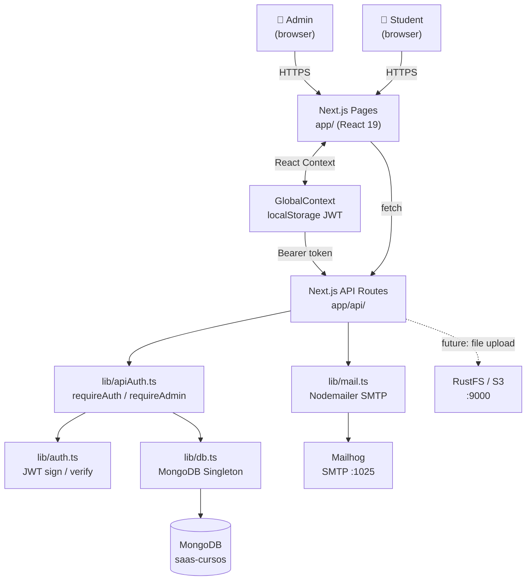
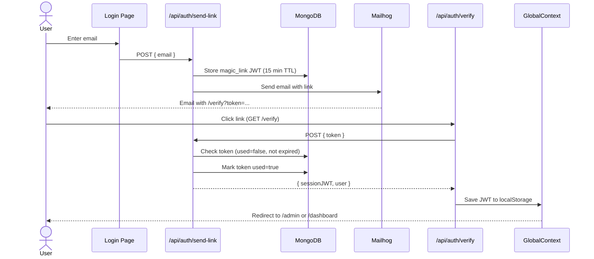

# CourseHub — SaaS Course Content Platform

A **Next.js 16 / React 19 SaaS application** that lets admins create and manage structured course content (courses → sections → resources) while students browse, read, and leave feedback on that content — all behind a passwordless magic-link authentication system.

---

## Features Implemented

### 1. Magic-Link Authentication
Passwordless login flow powered by short-lived JWTs (15 min) sent via email. On click the token is verified, a 7-day session JWT is issued, and the user is redirected to their role-specific dashboard.

- `lib/auth.ts` — JWT generation & verification (`jsonwebtoken`)
- `lib/apiAuth.ts` — `requireAuth()` / `requireAdmin()` guards for API routes
- `lib/mail.ts` — Nodemailer SMTP client (Mailhog in development)
- `app/api/auth/send-link/route.ts` — creates and emails the magic link
- `app/api/auth/verify/route.ts` — validates token, returns session JWT

### 2. Hierarchical Course Management (Admin)
Full CRUD for a three-level content hierarchy: **Course → Section → Resource** (Markdown). Resources support embedded YouTube links and formatted code blocks.

- Admin dashboard with live stats (course / section / resource counts)
- Ordered display via numeric `order` field on all entities
- Seed endpoint (`/api/seed`) populates two complete demo courses

### 3. Student Content Consumption
Students browse their enrolled courses, expand sections, and read markdown-formatted resources with GitHub-flavored syntax (tables, code fences, task lists). They can submit text feedback on any resource.

- `react-markdown` + `remark-gfm` for rich rendering
- `app/api/feedback/[resourceId]/route.ts` — persists comments to MongoDB
- Role-based routing: wrong-role users are automatically redirected

---

## Project Structure

```
courses/
├── app/
│   ├── api/
│   │   ├── auth/
│   │   │   ├── send-link/route.ts       # POST — generate & email magic link
│   │   │   └── verify/route.ts          # POST — verify token, return session JWT
│   │   ├── courses/
│   │   │   ├── route.ts                 # GET list / POST create course
│   │   │   └── [courseId]/
│   │   │       ├── route.ts             # GET / PUT / DELETE single course
│   │   │       └── sections/
│   │   │           ├── route.ts         # GET list / POST create section
│   │   │           └── [sectionId]/
│   │   │               ├── route.ts     # GET / PUT / DELETE single section
│   │   │               └── resources/
│   │   │                   ├── route.ts               # GET list / POST create resource
│   │   │                   └── [resourceId]/route.ts  # GET / PUT / DELETE resource
│   │   ├── feedback/
│   │   │   └── [resourceId]/route.ts   # POST — submit student feedback
│   │   └── seed/route.ts               # POST — populate DB with demo data
│   ├── admin/
│   │   ├── page.tsx                    # Admin dashboard with stats
│   │   └── courses/
│   │       ├── page.tsx                # Course list with CRUD actions
│   │       ├── new/page.tsx            # Create course form
│   │       └── [courseId]/page.tsx     # Edit course / manage sections & resources
│   ├── dashboard/
│   │   ├── page.tsx                    # Student course catalog
│   │   └── courses/[courseId]/page.tsx # Course viewer (sections + resources)
│   ├── login/page.tsx                  # Magic link request form
│   ├── verify/page.tsx                 # Token verification & redirect
│   ├── components/
│   │   └── AppShell.tsx               # Sidebar layout with role-based nav
│   ├── contexts/
│   │   └── GlobalContext.tsx          # Auth state (user, token) via React Context
│   ├── page.tsx                        # Public landing page
│   └── layout.tsx                      # Root layout wrapping GlobalProvider
├── lib/
│   ├── auth.ts                         # JWT sign / verify helpers
│   ├── apiAuth.ts                      # API route auth guards
│   ├── db.ts                           # MongoDB singleton (native driver)
│   ├── mail.ts                         # Nodemailer SMTP helper
│   └── types.ts                        # TypeScript interfaces for all domain models
├── .env.local                          # Environment variables (not committed)
├── next.config.ts                      # Next.js configuration
├── postcss.config.mjs                  # Tailwind CSS v4 PostCSS config
└── tsconfig.json                       # TypeScript strict config
```

---

## Architecture

### System Component Diagram



### Magic Link Auth Flow



## Design Patterns

| Pattern | Where |
|---|---|
| **Singleton** | `lib/db.ts` — one `MongoClient` instance reused across all API routes |
| **Middleware / Guard** | `lib/apiAuth.ts` — `requireAuth()` / `requireAdmin()` wrap handlers without coupling auth to business logic |
| **Context / Provider** | `GlobalContext.tsx` — React Context distributes auth state app-wide, avoiding prop drilling |
| **Repository-style API** | RESTful route handlers in `app/api/` map 1-to-1 to MongoDB collections |
| **Token-based Auth** | Short-lived magic-link JWTs + longer session JWTs; stored in `localStorage`, validated server-side on every request |
| **Server Components + Client Components** | Server components query MongoDB directly; client components call the JSON API |

---

## How It Works

1. **Login** — user submits email → `POST /api/auth/send-link` creates a 15-min JWT stored in the `magic_links` collection and emails a link. Clicking the link hits `POST /api/auth/verify`, which checks expiry and the `used` flag, then returns a 7-day session JWT that `GlobalContext` saves to `localStorage`.

2. **Content delivery** — authenticated students visit `/dashboard`, which fetches `/api/courses`. Selecting a course loads its sections and resources; clicking a resource renders Markdown inline.

3. **Admin CRUD** — admins manage courses at `/admin/courses` via the nested REST API. All mutating routes call `requireAdmin()` which decodes the `Authorization: Bearer <token>` header and rejects non-admin sessions.

```ts
// lib/apiAuth.ts — guard usage example
export async function requireAdmin(req: Request): Promise<User> {
  const user = await requireAuth(req);        // throws 401 if no valid JWT
  if (user.role !== 'admin') throw { status: 403, message: 'Forbidden' };
  return user;
}

// app/api/courses/route.ts
export async function POST(req: Request) {
  const admin = await requireAdmin(req);      // only admins may create courses
  const body = await req.json();
  const db = await getDb();
  const result = await db.collection('courses').insertOne({ ...body, createdAt: new Date() });
  return Response.json({ id: result.insertedId });
}
```

---

## Getting Started

### Prerequisites
- Node.js 20+
- Docker (for MongoDB, Mailhog, and Rustfs/MinIO)
- npm 10+

### Clone

```bash
git clone https://github.com/Jorgeaapaz/MISEIA_1-4-140-courses.git
cd MISEIA_1-4-140-courses
```

### Environment

Copy the example variables and adjust as needed:

```bash
cp .env.example .env.local
```

```env
MONGODB_URI=mongodb://localhost:27017
MONGODB_DB=saas-cursos
JWT_SECRET=magik-link-dev-secret-2026
MAILHOG_HOST=localhost
MAIL_PORT=1027
NEXT_PUBLIC_API_URL=http://localhost:3000
```

### Start services (Docker)

```bash
# MongoDB
docker run -d -p 27017:27017 mongo

# Mailhog (SMTP + web UI on :8025)
docker run -d -p 1027:1025 -p 8025:8025 mailhog/mailhog

# Rustfs / MinIO (S3-compatible)
docker run -d -p 10000:9000 minio/minio server /data
```

### Install & run

```bash
npm install
npm run dev        # http://localhost:3000
```

### Seed demo data

```bash
curl -X POST http://localhost:3000/api/seed
```

This creates an admin (`admin@coursehub.dev`) and a student (`student@coursehub.dev`) plus two full demo courses.

### Run tests

```bash
# Unit tests (Jest) — no server needed
npm test

# Unit tests with coverage report
npm run test:coverage

# E2E tests (Playwright) — requires dev server running
npm run dev &          # start dev server first
npm run test:e2e

# Install Playwright browsers (first time only)
npx playwright install chromium
```

### Build for production

```bash
npm run build
npm start
```

---

## Example Flows

### Successful login (magic link)

```
POST /api/auth/send-link  { "email": "admin@coursehub.dev" }
→ 200  { "message": "Magic link sent" }

# Mailhog web UI (http://localhost:8025) shows the email.
# Click the link → GET /verify?token=<jwt>

POST /api/auth/verify  { "token": "<jwt>" }
→ 200  { "token": "<session-jwt>", "user": { "email": "admin@coursehub.dev", "role": "admin" } }
# Redirected to /admin
```

### Expired / already-used token

```
POST /api/auth/verify  { "token": "<expired-jwt>" }
→ 401  { "error": "Token expired or already used" }
```

### Unauthorized access attempt

```
GET /api/courses  (no Authorization header)
→ 401  { "error": "Unauthorized" }

GET /api/courses  (Authorization: Bearer <student-token>)
POST /api/courses  →  403  { "error": "Forbidden" }
```

### Markdown resource rendering

Resources stored as raw Markdown (with embedded YouTube links, code fences, and tables) are rendered client-side via `react-markdown` with `remark-gfm`, giving students a rich reading experience directly in the browser.

---

## Tech Stack

| Layer | Technology |
|---|---|
| Framework | Next.js 16 (App Router) |
| Language | TypeScript 5 (strict) |
| UI | React 19, Tailwind CSS v4, custom CSS variables |
| Database | MongoDB 7 (native driver, no Mongoose) |
| Auth | JWT (jsonwebtoken) + magic links |
| Email | Nodemailer + Mailhog |
| Storage | AWS S3-compatible via Rustfs/MinIO |
| Markdown | react-markdown + remark-gfm |

---

## License

MIT
