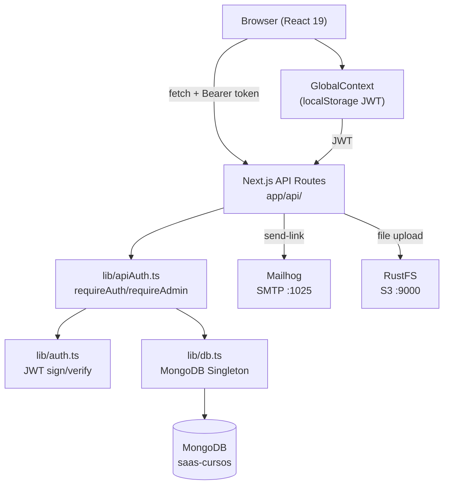

@~/.claude/prompts/new_functionality_prompt_spec.md

# Add Architecture Diagram to README

## Role
Act as a Software Architect with expertise in system design documentation and Mermaid diagrams.

## Context
- Project: Next.js 16 SaaS Course Platform (CourseHub)
- Issue: `dc_diagrama_arquitectura` — no architecture diagram exists in README or `docs/`
- The project has a clear layered architecture that needs to be visually documented

Architecture layers:
- **Frontend:** Next.js App Router (React 19, Tailwind CSS v4)
- **Auth Layer:** JWT magic links, GlobalContext, localStorage
- **API Layer:** Next.js route handlers in `app/api/`
- **Business Logic:** `lib/` (auth.ts, apiAuth.ts, mail.ts)
- **Data Layer:** MongoDB native driver via `lib/db.ts` singleton
- **External Services:** Mailhog (SMTP), RustFS/MinIO (S3), MongoDB

## Task
Add a Mermaid architecture diagram to `README.md` showing:
1. Component diagram: user → browser → Next.js server → MongoDB/Mailhog/RustFS
2. Auth flow diagram: email → magic link → JWT → localStorage → API guard
3. Content hierarchy diagram: Course → Section → Resource (optional, ASCII)

## Diagram Guidelines
- Use Mermaid (`\`\`\`mermaid`) syntax — renders natively on GitHub
- Show the two user roles (Admin and Student) and their different paths
- Show `lib/db.ts` as the single MongoDB access point
- Show `lib/apiAuth.ts` as the guard between API routes and MongoDB
- Keep it readable — max 20 nodes, no clutter
- Place diagram in README after "Architecture" heading, before "Getting Started"

## Output Format
Mermaid diagram block(s) to insert into README.md:

## Steps to Follow
1. Read current `README.md` to find the correct insertion point.
2. Create the Mermaid diagram covering the system architecture.
3. Create a second Mermaid diagram for the auth flow (magic link sequence).
4. Insert both diagrams into README.md under a new `## Architecture` section (or update existing one).
5. Commit: `docs: add Mermaid architecture and auth flow diagrams`.

## Output Checklist and Guardrails
- [ ] At least one Mermaid diagram in README
- [ ] Diagram shows both Admin and Student paths
- [ ] Diagram shows `lib/db.ts` as single MongoDB access point
- [ ] Diagram shows `lib/apiAuth.ts` as API guard
- [ ] Diagram renders correctly on GitHub (valid Mermaid syntax)
- [ ] Auth flow diagram shows magic link → JWT → localStorage → Bearer token sequence
- [ ] README still passes all other compliance checks after edit
